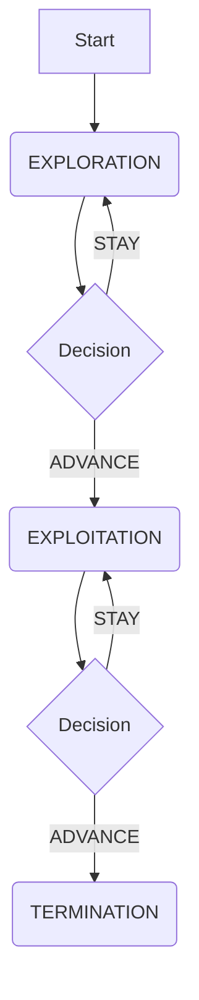

# Uni-directional Pipeline State Machine

## 1. Overview

This document formalizes the state machine for the meta-orchestrator's uni-directional pipeline, as required by step 1.1 of the `meta_orchestrator_design_manifesto.md`. The design is intentionally simple to keep the agent's decision-making process focused and lean.

## 2. States

The pipeline consists of three formal states:

1.  `EXPLORATION`: The initial state. The system uses a specialized exploration-focused, population-based solver to broadly survey the search space.
2.  `EXPLOITATION`: The second state. The system uses a specialized exploitation-focused, population-based solver to intensively search promising regions identified in the previous stage.
3.  `TERMINATION`: The final state. The search process is complete, and no further actions can be taken.

## 3. Transitions

The pipeline is uni-directional, meaning transitions only occur in one direction.

### Transition Logic

-   **Start → EXPLORATION:** This transition occurs automatically at the beginning of an episode.
-   **EXPLORATION → EXPLOITATION:** This transition is triggered exclusively by the RL agent's `ADVANCE` action. When this occurs, the entire population from the exploration solver is transferred to the exploitation solver.
-   **EXPLOITATION → TERMINATION:** This transition is also triggered by the `ADVANCE` action. It marks the end of the search process for the episode.

## 4. Action Space

The RL agent operates on a simple, binary action space at each decision point:

-   `STAY (0)`: Remain in the current state (`EXPLORATION` or `EXPLOITATION`) and continue running the current solver.
-   `ADVANCE (1)`: Transition to the next state in the sequence.

This design ensures the agent's only responsibility is to learn *when* to transition, not what solver to use or how to configure it.